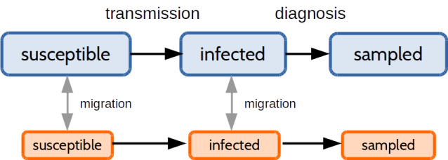
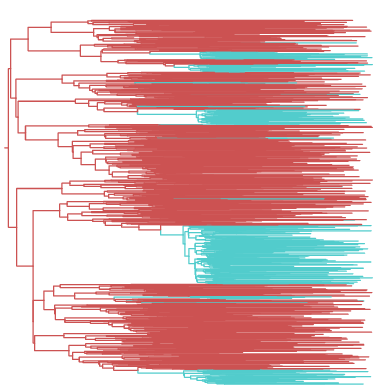
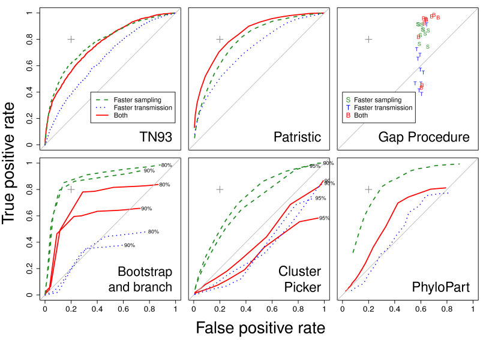

# HIV genetic clustering for molecular epidemiology:
## Why it doesn't work and how we can fix it
### Rosemary McCloskey and Art Poon
Western University, Ontario
Department of Pathology & Laboratory Medicine

---

## What is a genetic cluster?

<table><tr>
    <td width="50%"><ul>
    <li>A subset of sequences that are more similar to each other than the rest of the sample</li>
    <li>There are many methods for defining clusters</li>
    <li>Clustering is subjective</li>
    </ul></td>
    <td>
         
    </td>
</tr></table>

---

## Clustering and epidemiology

<table><tr>
    <td width="50%"><ul>
    <li>Early examples: characterizing outbreaks of HSV-1, TB from RFLPs</li>
    <li>Low genetic divergence may indicate recent transmission</li>
    <li>Tremendous interest in applying clustering to HIV outbreaks</li>
    <li>These methods have seldom been tested!</li>
    </ul>
    <small>Phylogeny from HIV-1 outbreak in Scottish prison (Yirrell et al, 1997)</small>
    </td>
    <td>
         
    </td>
</tr></table>

---

## Simulations

* Simulated trees (MASTER v5.0) under an epidemic model with 2 subpopulations
* Varied transmission and sampling rate of minority subpopulation

---

## Visualization

<table><tr>
    <td width="50%"><ul>
    <li>4 scenarios (faster sampling, faster transmission, both, neither)</li>
    <li>Faster sampling should shorten terminal branches</li>
    <li>Faster transmission should shorten internal branches</li>
    </ul>
    </td>
    <td>
         
    </td>
</tr></table>

---

## Example

---

## Method comparison

* Evaluated six different clustering methods
 1. HIV-Trace (TN93)
 2. Patristic distance
 3. Subtree clustering (bootstrap, Hue et al. 2004)
 4. ClusterPicker
 5. GapProcedure
 6. PhyloPart
* Simulated sequence evolution along trees, if necessary.

---

<small>
From Poon (2016) Virus Evol 2(2): vew031
</small>

---

## Clustering doesn't seem to work

* Simulations indicate that clusters represent variation in sampling rates

* Not variation in transmission rates!

