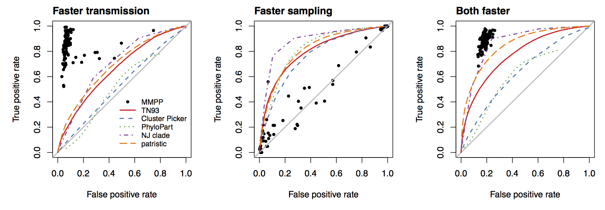
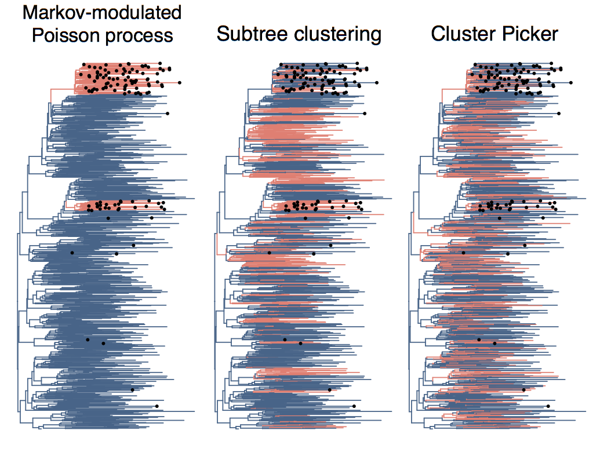

# A model-based clustering method for detecting variation in HIV transmission rates
### Rosemary McCloskey<sup>1</sup> and Art Poon<sup>2</sup>

<sup>1</sup> BC Centre for Excellence in HIV/AIDS, Canada<br/> 
<sup>2</sup> Department of Pathology & Laboratory Medicine, Western University, Canada


---

## Genetic clusters

* A subset of sequences that are more similar to each other than the rest of the sample population
* May correspond to a subpopulation with higher transmission rates
* Potential foci for public health interventions in near-real time
* Diverse nonparametric methods for generating clusters

---

## Potential causes of genetic clustering

* Variation in transmission rates 
* Variation in rates of sampling


<small>Figure from Villandre *et al* (2016) PLOS ONE 11(2): e0148459.</small>

---

## Simulation methods

* Simulated trees (*MASTER* v5.0) under a SIR model with 2 subpopulations (*N*=9000 and 1000)
  
* Varied transmission and sampling rate of minority subpopulation
* Simulated sequences with *INDELIBLE*, tuned to HIV-1 *pol* data

---

## Sanity check

<table><tr>
    <td width="50%"><ul>
    <li>4 scenarios (faster sampling and/or transmission)</li>
    <li>Faster sampling should shorten terminal branches</li>
    
    <li>Faster transmission should shorten internal branches</li>
    
    </ul>
    </td>
    <td>
         
    </td>
</tr></table>

---

## Example tree


Both transmission and sampling rates elevated in minority subpopulation (cyan).
1000 tips.

---

## Method comparison

* Simulated sequence evolution along each tree (*INDELIBLE*)
* Evaluated six different clustering methods
 1. HIV-Trace (*TN93*)
 2. Patristic distance
 3. Subtree clustering (bootstrap, branch-lengths)
 4. ClusterPicker
 5. GapProcedure
 6. PhyloPart 


---


<small>
From Poon (2016) Virus Evol 2(2): vew031
</small>

---

## Clusters of sampling?

* Current methods <u>*applied to simulations*</u> detect clusters of sampling, not clusters of transmission.
* Are we targeting public health responses on the most engaged groups?
* Can we develop a clustering method that targets variation in transmission rates?

---

## Focusing on transmission

* We assume the phylogeny approximates the transmission tree (no different from clustering)
* Let branching rate $\lambda$ switch between $K$ values along the tree as a Markov-modulate Poisson process (MMPP)
  
* Solve for maximum likelihood assignment of rates to branches

---



---


<small>Dots ("$\cdot$") indicate true minority sequences; higher transmission rates</small>

---

## Concluding remarks

* Some clusters are unambiguous (*e.g.,* Indiana, Saskatchewan)
* We need to be more skeptical about clustering methods
* Focusing on internal branch lengths may provide more informative clusters
* Source code available at
```html
http://github.com/rmcclosk/netabc
```

---

## Acknowledgements


<small>This work was supported in part by the Government of Canada through Genome Canada and the Ontario Genomics Institute (OGI-131)</small>


<small>Rosemary McCloskey implemented the model in C and performed the initial model validation.</small>


