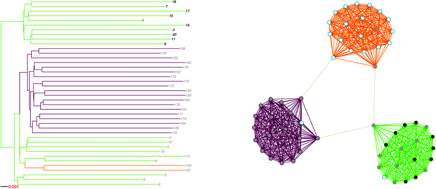
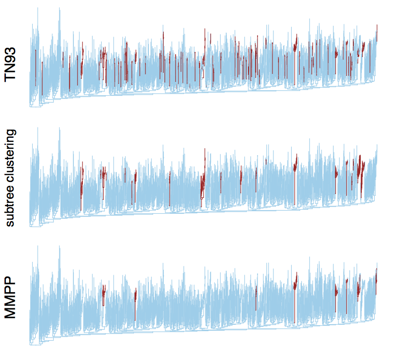

# A model-based clustering method for detecting variation in HIV transmission rates
### Rosemary McCloskey<sup>1</sup> and Art Poon<sup>2</sup>

<sup>1</sup> BC Centre for Excellence in HIV/AIDS, Canada<br/> 
<sup>2</sup> Department of Pathology & Laboratory Medicine, Western University, Canada


---

## Genetic clusters

* A subset of sequences that are more similar to each other than the rest of the sample population
* May correspond to a subpopulation with higher transmission rates
* Potential foci for public health interventions in near-real time
* Diverse nonparametric methods for generating clusters

---

## Potential causes of genetic clustering

* Variation in transmission rates 
* Variation in rates of sampling



<small>Figure from Villandre *et al* (2016) PLOS ONE 11(2): e0148459.</small>

---

## Simulation methods

* Simulated trees (*MASTER* v5.0) under a SIR model with 2 subpopulations (*N*=9000 and 1000)
  
* Varied transmission and sampling rate of minority subpopulation
* Simulated sequences with *INDELIBLE*, tuned to HIV-1 *pol* data

---

## Sanity check

<table><tr>
    <td width="50%"><ul>
    <li>4 scenarios (faster sampling and/or transmission)</li>
    <li>Faster sampling should shorten terminal branches</li>
    
    <li>Faster transmission should shorten internal branches</li>
    
    </ul>
    </td>
    <td>
         
    </td>
</tr></table>

---

## Example tree


Both transmission and sampling rates elevated in minority subpopulation (cyan).
1000 tips.

---

## Method comparison

* Simulated sequence evolution along each tree (*INDELIBLE*)
* Evaluated six different clustering methods
 1. HIV-Trace (*TN93*)
 2. Patristic distance
 3. Subtree clustering (bootstrap, branch-lengths)
 4. ClusterPicker
 5. GapProcedure
 6. PhyloPart 


---


<small>
From Poon (2016) Virus Evol 2(2): vew031
</small>

---

## Clusters of sampling?

* Current methods <u>*applied to simulations*</u> detect clusters of sampling, not clusters of transmission.
* Are we targeting public health responses on the most engaged groups?
* Can we develop a clustering method that targets variation in transmission rates?

---

## Model-based clustering

* Let branching rate $\lambda$ switch between $K$ values along the tree as a Markov-modulated Poisson process (MMPP)


* Solve for maximum likelihood assignment of rates to branches with pruning algorithm

`$$ L_i(v) = \sum_j \Lambda_{ij}\exp((Q_{ij}-\Lambda_{ij})t_v) L_j(w) L_j(z)$$`

---

## Assumptions

* We assume the phylogeny approximates the transmission tree (same as other methods)
* Tips are missing data (unknown waiting time to branching event)
* Our model is uninformative about sampling rates.


---


* <small>100 replicate simulations per scenario</small>
* <small>for MMPP, some replicates had high FPR because the fast rate class was assigned to the root.</small>

---


<small>Dots ("$\cdot$") indicate true minority sequences; higher transmission rates</small>

---

## Computing time

* How many seconds to process a tree with 1000 tips?

| Method | Tree? | MP? | T1 | T2 | T3 | T4 | T5 | Average |
|--------|-------|-----|----|----|----|----|----|---------|
| MMPP | yes | no | 27.3 | 31.6 | 32.5 | 33.4 | 27.4 | 30.4 |
| TN93 | no | yes | 1.46 | 1.24 | 1.21 | 1.21 | 1.17 | 1.26 |
| Cluster Picker | yes | yes | 1.45 | 3.97 | 2.87 | 6.20 | 4.42 | 3.78 |
| PhyloPart | yes | yes | 2.78 | 3.11  | 4.64  | 7.20  | 6.01 | 4.75 |
| Subtree clustering | yes | no | 2.73 | 2.69 | 2.74 | 2.78 | 2.83 | 2.76 |
| Patristic* | yes | no | 82.5 | 67.6 | 95.8 | 71.7 | 71.2 | 77.8 |

* Not including time to reconstruct trees.

<small>* Patristic method includes nonparametric bootstrap (100 samples)</small>

---
## Real data

* Obtained *n*=3102 published HIV-1 *pol* sequences from a cohort study of MSM in Seattle (Wolf *et al.*, in press)
* Reduced to one sequence per patient, non-recombinant subtype B (*n*=1653)
* Reconstructed an ML tree and applied different clustering methods.

---



---

## Caveats

* *Model misspecification*: Variation in transmission rates among lineages can be confounded with population-level dynamics.
* Causes MMPP to assign fastest rate class to root of tree, leading to high FPR.
* For real data set, we used 3 rate classes - branches with highest rate class were assigned to clusters.

---

## Concluding remarks

* A promising new approach to genetic clustering?  (*See also* T. Stadler.)
* Several directions for further work (*e.g.*, model selection, optimization).
* Source code available at
```html
http://github.com/rmcclosk/netabc
```
* User-friendly version if we get funding &#x1f607;.

---

## Acknowledgements

<table>
 <tr>
  <td width="60%">
   This work was supported in part by the Government of Canada through Genome Canada and the Ontario Genomics Institute (OGI-131); and by a Project Grant from the Canadian Institutes for Health Research (CIHR).
   <br/><br/>
    I'm supported by a CIHR New Investigator Award.
   <br/><br/>
   **Rosemary McCloskey** implemented the model in C and performed the initial model validation.
   
  </td>
  <td>
   
    
    
  </td>
 </tr>
</table>


