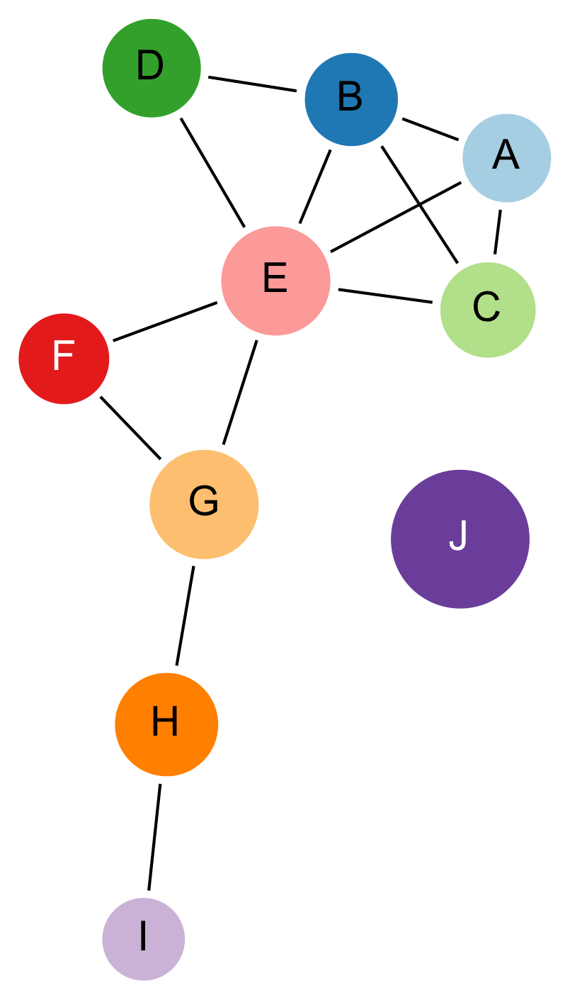

# Phylogenetic forensic science and implications for HIV criminalization
### Art Poon1

<small> 
1 Western University, Department of Pathology & Laboratory Medicine
</small>

---

## HIV genetics

* HIV evolves rapidly - an infection becomes genetically unique within weeks of transmission
* Genetic sequencing is standard of care
* We have learned a great deal from the comparative study of HIV sequence variation
  * drug resistance
  * adaptation to the immune system
  * history of the pandemic

---

## Genetic clustering

<table><tr>
  <td width="60%"><ul>
    <li>An increasingly popular method for analyzing HIV sequences</li>
    <li>A **genetic cluster** is a group of HIV sequences that are more similar to each other than to other sequences in the sample population</li>
    <li>Uses a **genetic distance** - a formula that quantifies the differences between two sequences</li>
  </td>
  <td>
    
  </td>
</tr></table>

---

## Clustering and real-time epidemiology
 * Rapidly growing interest in using genetic clustering to monitor epidemics
 * In B.C., real-time monitoring system integrated with HIV treatment database
 * Supported public health responses to potential transmission outbreaks
 

---

## HIV genetics and criminalization
<table><tr>
  <td width="60%"><ul>
    <li>Long, troubled history between HIV genetic analysis and criminalization</li>
    <li>Potential misuse/misinterpretation of genetic data</li>
    <li>What are the potential costs?  What are the benefits?</li>
    <li>What are the implications of recent advances in HIV phylogenetics?</li>
  </td>
  <td>
    
  </td>
</tr></table>

---

## Misinterpreting clusters
<table><tr>
  <td width="60%"><ul>
    <li>Clusters are often depicted as network diagrams</li>
    <li>Each node represents a person -- each line (edge) indicates genetic similarity</li>
    <li>Edges do *not* represent a contact or transmission event</li>
    <li>"Hub" individuals are *not* "superspreaders"</li>
  </td>
  <td>
    
  </td>
</tr></table>
<small>This network was generated from clustering sequences simulated on a tree where *E* was in the middle of a transmission chain, and diagnosed earlier.</small>

---

## Misinterpreting phylogenies

* A phylogeny is a tree that represents how different populations are related by common ancestors
* A branching point in an HIV phylogeny does *not* represent a transmission event

  

---

## Recent advances

* Consensus position has been that one cannot conclude that *A* transmitted to *B* on the basis of genetic similarity/phylogeny of infections
* Recent advances in the field have been challenging this position
  1. Within-host diversity and paraphyly
  2. Bayesian inference
  3. Data augmentation
  

---

## Within-host diversity

<table><tr>
  <td width="65%"><ul>
    <li>The virus population within a person becomes very diverse over time</li>
    <li>If one of those variants becomes transmitted to the next person, then the next population may be nested within the first.</li>
    <li>Sequences from the first person are said to be *paraphyletic*</li>
    <li>Already applied to HIV transmission cases</li>
  </td>
  <td>
    
  </td>
</tr></table>

<small>Metzker *et al.* (2002) PNAS 99: 14292; Romero-Severson *et al.* (2016) PNAS 113: 2690.</small>

---

## Bayesian inference

---

## Data augmentation

* Incorporating epidemiological observations into the reconstruction of transmission events
* Distribution of time interval between transmission events (SARS, Jombart *et al.* 2014 PLCB 10)
* 

---

## Acknowledgements

<small>This work was supported in part by the Government of Canada through Genome Canada and the Ontario Genomics Institute (OGI-131)</small>

