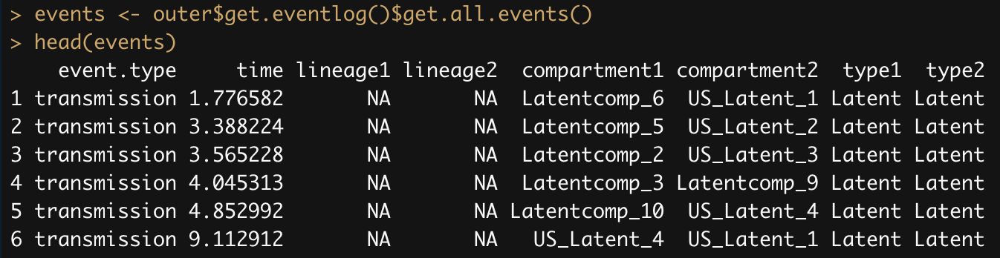

```{r setup, include=FALSE}
knitr::opts_chunk$set(echo = FALSE)
```


## The latent HIV reservoir

* HIV provirus in the latent reservoir may come from an early or late stage of infection.
  * Adaptation to host-specific immune response, drug resistance.

* Is long-term persistence of the reservoir due to clonal expansion or ongoing replication?
  * Replication in anatomic compartments with low drug penetrance would replenish a "young" reservoir.

---

<table>
  <tr>
    <td>
      <h2>Dating HIV integration events</h2>
      <ul>
        <li>Replication-competent provirus from the latent reservoir can be sequenced from viral outgrowth experiments.</li>
        <li>One approach is to build a phylogeny and map outgrowth sequences to dated plasma HIV RNA.</li>
        <li>A tree is an incomplete sample of lineages, uncertainty in topology and location of root.</li>
      </ul>
    </td>
    <td width="40%">
      
      <small>
      Image source: Abrahams et al. (2019) The replication-competent HIV-1 latent reservoir is primarily established near the time of therapy initiation. Science Trans Med 11(513).
      </small>
    </td>
  </tr>
</table>

---

<table>
  <tr>
    <td>
      <h2>Root-to-tip regression</h2>
      <ul>
        <li>Under a strict molecular clock, the expected number of mutations increases linearly with time.</li>
        <li>A [root-to-tip (RTT)](https://slides.filogeneti.ca/include/rtt.html) method regresses divergence from the root ($y$-axis) on sample collection dates ($x$-axis).</li>
        <li>Fit regression to HIV RNA only, use model to predict integration dates.</li>
        <li>May be more robust to uncertainty in tree.</li>
      </ul>
    </td>
    <td width="40%">
      
      <small>
      Image source: Buonagurio DA, <i>et al.</i>. Evolution of human influenza A viruses over 50 years: rapid, uniform rate of change in NS gene. Science. 1986 May 23;232(4753):980-2.
      </small>
    </td>
  </tr>
</table>

---

## Problems with RTT dating
<table>
  <tr>
    <td>
      <ul>
        <li>Ignores variation in number of mutations &mdash; there is one, and only one, estimated date.</li>
        <li>Unclear how to deal with divergent outgrowth sequences.</li>
        <li>Proviral sequences can be mapped to the future (<i>right</i>, red zone).</li>
        <li>Assumes location of root and clock rate are known without error.</li>
      </ul>
    </td>
    <td width="45%">
```{r fig.width=4, fig.height=4, fig.align="right", warning=FALSE}
require(chemCal, quiet=T)
set.seed(18)
x <- rnorm(20); x0 <- 1
y <- x+rnorm(20)
fit <- lm(y[x<x0]~x[x<x0])
pred.y <- function(x) {fit$coef[1] + fit$coef[2]*x}

par(mar=c(3,3,1,1))
plot(x, y, bty='n', xaxt='n', yaxt='n', xlab='', ylab='', type='n')
axis(side=1, labels=FALSE, adj=1)
title(xlab="Sample collection date", line=1, cex=1.1)
title(ylab="Divergence from root", line=1, cex=1.1)
axis(side=2, labels=FALSE, adj=1)
abline(v=x0, lty=2)
text(x=x0, y=3.3, xpd=NA, label="ART initiation", adj=0, cex=0.8)
x1 <- 5
y0 <- pred.y(x0)
segments(x0=x0, x1=x1, y0=y0, lty=2)
rect(xleft=x0, xright=x1, ybottom=-5, ytop=y0, 
     col=rgb(0,0.8,0,0.3), border=NA)
polygon(x=c(x0, x1, x1, x0), y=c(y0, y0, pred.y(x1), y0), 
        col=rgb(1, 0.8, 0, 0.3), border=NA)
polygon(x=c(x0, x1, x0, x0), y=c(y0, pred.y(x1), pred.y(x1), y0), 
        col=rgb(1, 0, 0, 0.3), border=NA)
points(x, y, pch=ifelse(x>x0, 19, 1))
preds <- sapply(y[x>x0], function(z) inverse.predict(fit, z)$Prediction)
segments(x0=x[x>x0], x1=preds, y0=y[x>x0])
abline(fit)
```
    </td>
  </tr>
</table>

---

## A simple Bayesian model

* The RTT regression model has three parameters:
  1. The date of the origin ($x$-intercept);
  2. The molecular clock (rate/slope, $\mu$);
  3. The location of the root in the tree (determines divergence, $y$)

* We will sample these parameters from the posterior distribution.

  * Continue to assume the unrooted tree is known without error (constrains positioning of root).

---

## Poisson likelihood

* A strict clock assumes that mutations accumulate at a constant rate $\mu$ over time, so variation is equal to the mean (Poisson).
  * Let $Y_i$ be the number of mutations in the $i^{\textrm{th}}$ sequence, given location of root.
  * Let $\Delta t_i$ be the time elapsed between the $i^{\textrm{th}}$ sample and the root.
* The log-likelihood for RNA set $\{Y_i, \Delta t_i\}$ is:

$$\log L(Y_i, \Delta t_i) = \sum_i Y_i\log(\mu \Delta t_i) - \mu \Delta t_i - \log \Gamma(Y_i+1)$$

---

## Metropolis-Hastings sampling

| Parameter | Prior | Proposal |
|-----------|-------|----------|
| Root      | Uniform | $\textrm{Unif}(-\delta, +\delta)$, reflection on tips and random choice of branches at splits. |
| Clock rate | Lognormal | $\textrm{Unif}(-\delta, +\delta)$ proposal reflecting on zero. |
| Origin date | Uniform | Truncated normal proposal with mean 0 and variance $\sigma$. |

---

## Sample run

<table>
  <tr>
    <td></td>
    <td width="60%">
      
      <small>Step 180</small>
      
      <small>Step 19980</small>
    </td>
  </tr>
</table>

---

## Sampling integration dates

* Using Bayes' rule, the probability of integration time $t_i$ for outgrowth sequence with divergence $Y_i$ is:
$$P(t_i|Y_i) = \frac{P(Y_i|t_i) P(t_i)}{P(Y_i)}$$

* We assume $P(t_i) = \frac{1}{T-t_0}$, where $t_0$ is the origin date and $T$ is the maximum integration date, and letting $s=t-t_0$:

$$
P(Y_i) = \frac{\int_0^{T-t_0} (\mu s)^{Y_i} \exp(-\mu s) \mathrm{d}s}{(T-t_0)\Gamma(Y_i+1)}
 = \frac{\gamma(Y_i+1, \mu(T-t_0))}{\mu(T-t_0)\Gamma(Y_i+1)}
$$

where $\gamma(s, x)$ is the lower incomplete gamma function.

---

## Sampling integration dates (2)

* Letting $\Lambda=\mu(T-t_0)$, the probability of $t_i$ given $y_i$ mutations simplifies to: 
$$
P(t_i | Y_i) = \frac{\mu \Lambda^{y_i}\exp(-\Lambda)}{\gamma(Y_i+1, \Lambda)}
$$

* Since we can't solve for the inverse CDF, we use a simple rejection method to sample integration times.
  * $t_0$, $y_i$ and $\mu$ are sampled from the posterior distribution.

---

## Simulation model

* We used an exact stochastic simulation module in R (`twt`) to simulate cell population dynamics (forward time).
* Discrete events with exponential waiting times determine population dynamics over time.


```{r eval=FALSE, echo=FALSE}
require(twt, quietly=TRUE)

setwd("~/git/bayroot/")
prefix <- "latent1"
model <- Model$new(yaml.load_file(paste0(prefix, '.yaml')))
set.seed(1)
outer <- sim.outer.tree(model)

pdf("~/slides/img/cellular-model-dynamics.pdf", width=5, height=5)
plot(outer, type='s', cex=0.5)
abline(v=10, lty=2)
dev.off()

pdf("~/slides/img/cellular-model-dynamics.pdf", width=5, height=5)
par(mar=c(5,5,1,3)) 
plot(outer, type='s', cex=0.5)
abline(v=10, lty=2)
dev.off()
```

---

## Simulating population dynamics

<table>
  <tr>
    <td>
      <ul>
        <li>Branching events require a "source" cell to induce a "target" cell to change state.</li>
        <ul>
          <li>Transmission of virus from an infected cell to a susceptible cell.</li>
          <li>Virus replication completely blocked by ART initiation at time $t=10$.</li>
        </ul>
        <li>Transition events occur when a cell switches from one state (compartment) to another.</li>
        <ul>
          <li><i>e.g.</i>, reactivation of a latently-infected cell.</li>
        </ul>
      </ul>
    </td>
    <td width="45%">
      
      
    </td>
  </tr>
</table>

---

## Simulating trees

<table>
  <tr>
    <td>
      <ul>
        <li>From the population size trajectories, `twt` samples trees in reverse time for given sampling times and cell types.</li>
        <ul>
          <li>&#9650;	= branching event (infection from active cell, or clonal expansion of latent cell)</li>
          <li>&#9675; = state transition (from active to latent or vice versa)</li>
        </ul>
        <li>Retaining these tree annotations lets us collapse branches associated with latently-infected cells.</li>
      </ul>
    </td>
    <td width="50%">
      
    </td>
  </tr>
</table>


```{r eval=F, echo=F}
L <- tree.layout(phy)
pch <- list('transmission'=17, 'transition'=1, 'tip'=19)
png("~/slides/img/cellular-model-tree.png", width=5*150, height=5*150, res=150)
plot(L, type='n') #, label='b', srt=30, cex=0.5)
lines(L, col=ifelse(L$edges$from.type=='Active', 'salmon', 'dodgerblue'), lwd=2)
points(L$edges$x1, L$edges$y1, cex=0.7,
       pch=as.integer(pch[L$edges$event.type]))
dev.off()
```

---

## Simulating evolution

* Ran trees from `twt` through INDELible
  * TN93 nucleotide substitution model with 40% `A`s.
  * Seeded with an HIV-1 subtype C \textit{pol} sequence at the root (AY772699)
* Reconstructed trees from simulated alignments with FastTree2 (double precision build).

---

## Comparing `bayroot` to root-to-tip regression

When clock signal is strong, advantage of `bayroot` is largely due to prior information about ART initiation.

<table>
  <tr>
    <td>
      
      <small>Integration date estimates for one replicate simulation.</small>
    </td>
    <td width="35%">
      
      <small>Paired Wilcoxon sign-rank test, $P=3.55\times 10^{-4}$, $n=50$.</small>
    </td>
  </tr>
</table>

```{r echo=FALSE, eval=FALSE}
tf <- "~/git/bayroot/data/latent1.19.cens.nwk.fas.ft2.nwk"  # 8, 17
cf <- gsub("\\.cens\\.nwk\\.fas\\.ft2\\.nwk", ".times.csv", tf)
phy <- read.tree(tf)
rt <- root2tip(phy)
true.vals <- get.true.values(rt, cf)
settings <- list(seq.len=1233, format="%Y-%m-%d", mindate=as.Date("1999-12-01"),
                 maxdate=as.Date("2000-04-01"), meanlog=-5, sdlog=2,
                 root.delta=0.01, date.sd=10, rate.delta=0.01)
res <- fit.bayroot(tf, cf, settings=settings, nstep=2e4, skip=20)

png("~/slides/img/latent1.19.compare.png", width=5*300, height=4*300, res=300)
par(mar=c(5,5,1,1))
plot(rt, true.vals=true.vals, xlab="Collection date (months since origin)", ylab="Divergence"); abline(v=10, lty=2)
est <- get.estimates(res, rt)
points(est$est, est$div, pch=19, col=rgb(0,0,1,0.5), cex=0.8)
segments(x0=est$lo95, x1=est$hi95, y0=est$div, col=rgb(0,0,1,0.3), lwd=5)
legend(x=13, y=0.03, legend=c("RTT", "bayroot", "true date"), cex=0.8,
       col=c('red', 'blue', 'black'), pch=c(19, 19, 3), pt.lwd=2)
dev.off()
```

---

## ... and with greater uncertainty

<table>
  <tr>
    <td>
      
      <small>
      Integration date estimates for one replicate simulation.
      </small>
    </td>
    <td>
      
      <small>
      Paired Wilcoxon sign-rank test, $P=3.82\times 10^{-7}$, $n=50$.
      </small>
    </td>
  </tr>
</table>

Results with a narrow prior on root date; with a less informative prior, `bayroot` results become similar to RTT.

---

## Application to real data

ZM1044M, Zambia-Emory HIV Research Project
<table>
  <tr>
    <td>
      
    </td>
    <td>
      
    </td>
  </tr>
</table>

<small>
Brooks *et al.*, 2020, PLOS Pathog 16(6): e1008378.
</small>

---

## Further work

* A simple and efficient means of incorporating prior knowledge and managing uncertainty in dating the HIV reservoir.
* Characterize sensitivity of `bayroot` to varying model parameters, *e.g.*, transition of active infected T-cell to resting state.
* R package available from `https://github.com/PoonLab/bayroot`

<small>
This study was supported by funding from CIHR and NIH (REACH AI164565-01).  RC was supported by an Ontario Genomics-CANSSI Fellowship in Genome Data Science.
</small>
<table>
  <tr>
    <td></td>
    <td></td>
    <td></td>
    <td></td>
  </tr>
</table>
